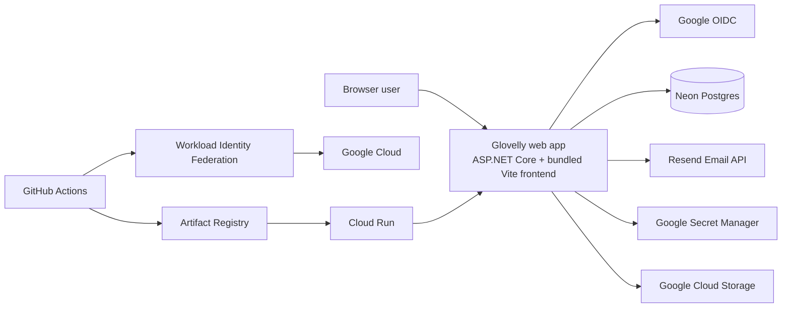

# Architecture

Glovelly is a compact, cloud-hosted web application for self-employed business administration. It supports authenticated access, clients, gigs, expenses, receipt attachments, invoices, Google Drive publishing, email delivery, admin user management, and a small read-only MCP business data surface.

The system should stay pragmatic and cost-conscious. Avoid architecture theatre, keep deployment simple, and keep the internal boundaries clean enough that the app can grow without becoming soup.

## Architecture At A Glance

## Runtime Shape

The preferred runtime shape is one deployable web application container unless there is a clear reason to split services.

That gives Glovelly one image, one Cloud Run service, one release unit, no separate frontend hosting tier, fewer CORS and distributed deployment problems, and a simpler cost and operations profile.

Frontend and backend are separate concerns at build time. The Vite frontend is built first, copied into the ASP.NET Core publish output under `wwwroot`, and served by the backend at runtime.

## Logical System View

The browser frontend owns user/admin journeys and calls the API for authenticated application workflows.

The ASP.NET Core backend is responsible for serving the frontend, Google authentication integration, mapping Google identities to Glovelly users, enforcing application authorisation, running business workflows, persistence through EF Core, and integrations such as email, Google Drive, and storage.

Neon Postgres is the primary system of record for Glovelly users, roles/access metadata, clients, gigs, invoices, expenses, receipts, delivery records when captured, and future domain entities.

Google OpenID Connect authenticates external identities. Google proves who the user is; Glovelly decides whether that user is allowed in and what they can do.

Resend provides outbound transactional email. It is an infrastructure integration, not core domain logic.

Cloud Run hosts the deployed container, Artifact Registry stores images, Secret Manager stores runtime secrets where appropriate, and GitHub Actions builds and deploys the image through Workload Identity Federation.

## Internal Boundaries

Even while the deployed application remains a single process, code should preserve clear conceptual boundaries:

- Identity and authentication integration
- Application authorisation and current-user context
- Domain models and business workflows
- Persistence and EF Core configuration
- Integrations such as Resend, Google Drive, and blob storage
- Presentation/UI/admin journeys
- Deployment and configuration concerns

Domain logic should not depend directly on provider APIs. Domain entities should not depend on Google claims. UI code should not be responsible for enforcing server-side security rules. Cloud Run and GitHub Actions concerns should not leak into business workflows.

## Data Segregation

Glovelly currently uses one application database. Internal Glovelly users are first-class entities, and business data should relate to Glovelly user IDs or future account/tenant constructs rather than directly to Google claims or email addresses.

Important principles:

- External identity is not domain ownership.
- Application users are first-class.
- The Google subject ID is the stable external login binding once known.
- Email is administrative/contact data.
- The model should prepare for multi-user or multi-tenant evolution without overbuilding now.
- User-scoped data should be loaded through paths that understand the current Glovelly user and permissions.
- Audit metadata should reference internal Glovelly user IDs, not raw emails or provider claims.

## External Integrations

### Google OIDC

Purpose: user authentication.

Glovelly responsibility: map claims to internal users and enforce application access.

### Neon Postgres

Purpose: primary relational data store.

Glovelly responsibility: schema, migrations, access patterns, ownership rules, and treating Postgres as the source of truth in production.

### Resend

Purpose: outbound transactional email for invoice delivery, access/admin notifications, and future transactional messages.

Glovelly responsibility: compose and send appropriate messages, store internal delivery intent/status where needed, and keep provider-specific behavior isolated behind email services.

### Google Cloud Run

Purpose: managed runtime hosting for the containerised app.

Glovelly responsibility: container health, runtime configuration, logs, and service deployment.

### Google Artifact Registry

Purpose: container image storage.

Glovelly responsibility: publish versioned images from CI/CD and deploy them consistently.

### Google Secret Manager

Purpose: production secret storage.

Glovelly responsibility: define required secrets/configuration and keep values out of source control.

### Google Cloud Storage

Purpose: blob storage for receipt attachments and generated invoice PDFs when configured.

Glovelly responsibility: store domain blobs through application storage abstractions rather than direct provider calls from endpoints.

### GitHub Actions

Purpose: CI/CD automation.

Glovelly responsibility: build, test, publish the image, and deploy to Cloud Run.

### Workload Identity Federation

Purpose: secure GitHub-to-GCP authentication without long-lived Google service account JSON keys in GitHub.

Glovelly responsibility: configure the trust boundary carefully, ideally constrained to repository, owner, and ref as appropriate.

## Security Posture

Google authenticates identity; Glovelly authorises access.

A valid Google login is not, by itself, sufficient to access Glovelly. The backend maps the Google identity to an internal Glovelly user, verifies that the user is active, and authorises work against Glovelly roles and ownership rules.

Secrets must not be committed to source control. Production secrets should live in Google Secret Manager or secure Cloud Run configuration. GitHub Actions should authenticate to GCP with Workload Identity Federation rather than static service account keys.

The application should log enough to diagnose access and enrolment issues, but must not log secret values, OAuth tokens, API keys, or other sensitive credential material.

## Known Gaps

These areas are expected to evolve:

- richer admin portal flows for enrolment
- user-facing documentation for invoice, email, receipt, and Google Drive workflows
- email delivery status, bounce handling, and Resend webhooks
- a more formal role/permission model
- future account/tenant model if Glovelly grows beyond personal/small-circle use
- observability and operational dashboards
- backup/restore posture for Neon data
- production incident and runbook notes

